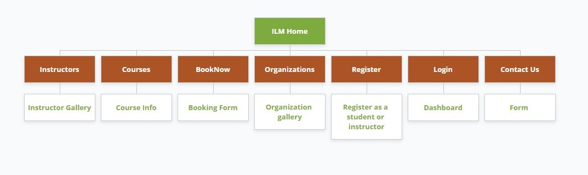
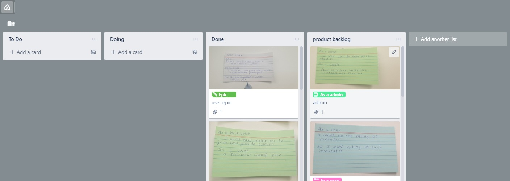
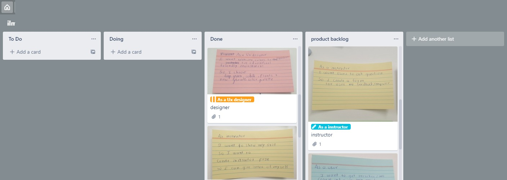
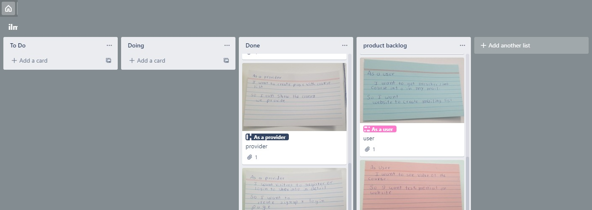
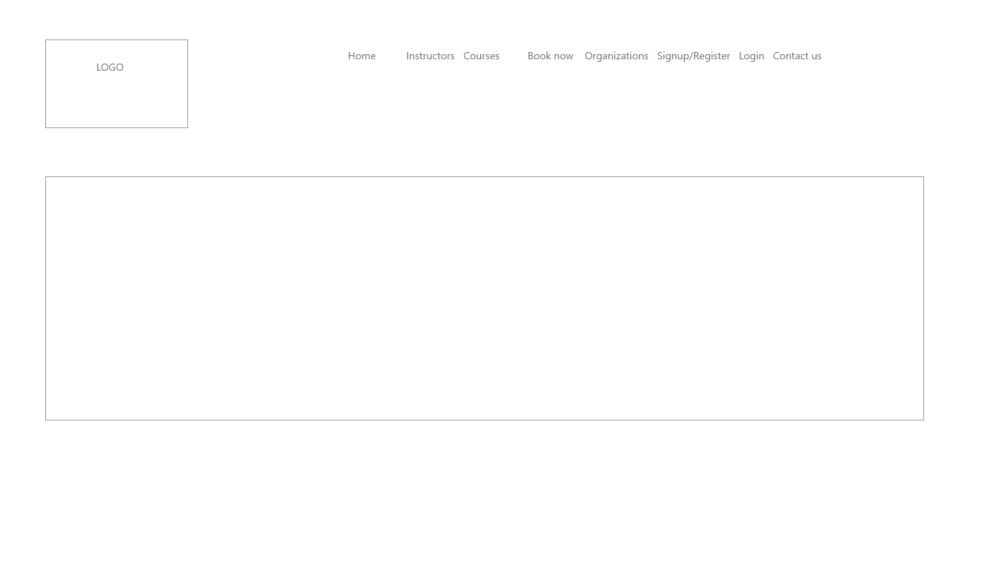
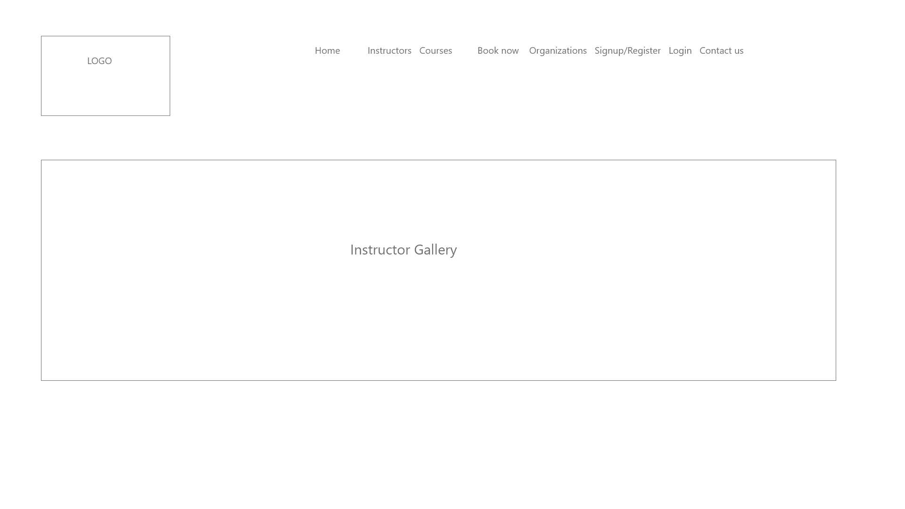
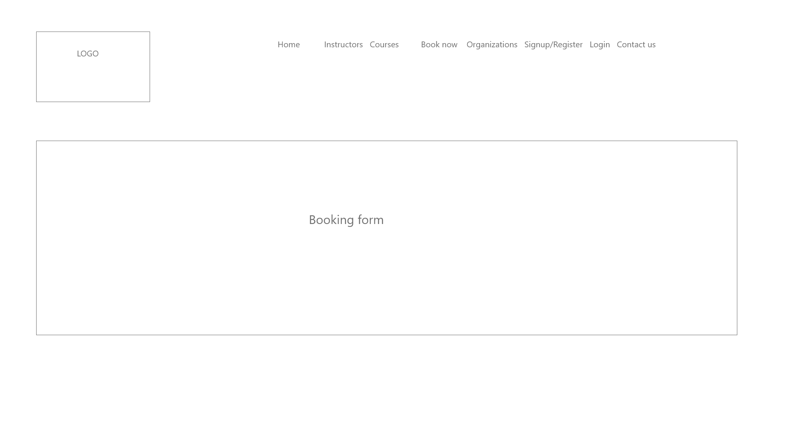
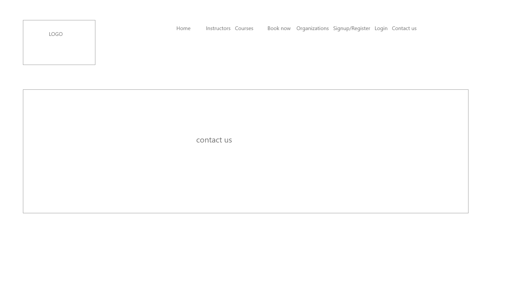
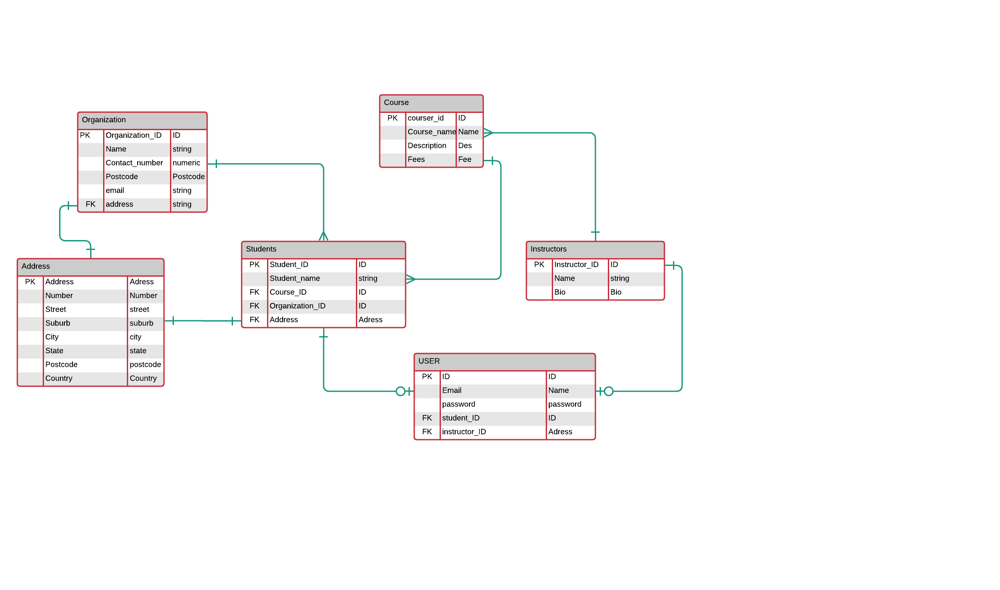

# README

### Identification of the problem you are trying to solve by building this particular marketplace app.

Digital technology has become part of our daily lives. To learn and explore these
technologies is became essential. There are many different institutes offer coding & computer/technology related
courses which is really beneficial for the future of the children.
Having said that there are many children do not have access to learn these 
technology .Migrant families , refugees who have just arrived in country or low income familes who
do not have enough finance or support to let their children participate in these activies.
Further, people with some religious background needs more encouragement as they feel isolated from the mainstream
population. There are many organization who helps refugees or migrants to settle down and teach English for adjusting 
themselves in society. Where mosques,churches & other religious places across the nations also offeres  language course for the people who
attend there but in all these kinds of organizations lack support when it comes to learn the technology.
They do not have enough fund or support/communications from the tech industry which would be essential part of their lives.
To solve this problem I wanted to create something which can be a brigde between these organizations and people who can offer
their Services as a volunteer. Ilm (which literally means knowledge in arabic) application which will allow connect organizations and
instructors to connect for the workshops. Instructors will be able to register as a service provider & also will be able to create courses.
Courses (workshops)will range from 1 day 3 days depends on course requirement. Courses will strickly related to the technology and suitable for 
various age groups. Other hand organizations can book these workshops .Delivery of the course (workshops)will be physical.For including more support
from the tech world website will collect donations (like old laptops, ipads, tablets)from the companies and will be use during workshops.
In future , we also want to add services like offering 3/6/12 months free courses along with short workshops.
We also want to make it available for wider community in future like remote areas, small schools and women groups to encourage women to pursue
I.T. careers.

There are many applications offer similar services but all of them are not tailor made for  opportunities for both directions.
Most of them are paid services . There is big gap of communications & encouragement when it comes to really
empower our future generations. Our goal is make every children to learn this skill for free.

### Why is it a problem that needs solving?

First problem is lack of equal opportunities for the people come from migrant /refugee backgrounds. There is no doubt that future jobs would use 
technologies for various purpose. Similar to maths,english,science or artistic skills which is taught to children since they are small may impact to 
gain good working opportunities. It's not only limited to secure work but also these skills help them to make their day to day life much easier.
Similarly when child learn the basics of the technologies like how it works , what could be created or implemented than it boost their confidence to 
become more active participant in this technological world. We often criticize that people do not have enough skills to make their working conditions better
but we forget to look at the other side of the story which doesn't give enough or equal opportunities for the people who do not have resources to even 
learn those skills in first place. Also, there is huge communications gap between people coming from different culture and religious backgrounds. I believe 
technology plays important role to connect them .I like to put an example to understand this problem broadly. Mosque have many student attend language classes
and they want students to learn technology so it could be helpful to share their future. now mosque might not have enough funding to afford this kind courses, 
children's parents might be migrant or refugee who is settling in the country and do not have financial resources to afford courses.
There could be possibility how to find any teacher who can teach this subject (either discounted fees or volunteer).At the other hand someone with good IT skills 
and like to offer which could be socially beneficial .They don't know who needs support.That is the main reason for create a bridge between these two parties .
It would be beneficial for the both the ends.

### A link (URL) to your deployed app (i.e. website)

### A link to your GitHub repository (repo)

https://github.com/techiemum/ilm 

### Description of your marketplace app (website), including:
- Purpose
- Functionality / features
- Sitemap
- Screenshots
- Target audience
- Tech stack (e.g. html, css, deployment platform, etc)

*  Purpose

    To create a solution for migrant/refugee/lowincomefamily/orphans children to get access 
    to the learning technology. Further, helps organizations to book workshops for children 
    under their care or connected. For skillful people in IT to offer their 
    skills for community purpose, to donate their time for satisfaction purpose.
    For companies to be active part of social work and donate items.

* Functionality/features

    Login & Signup as a instructor && student
    Booking workshop link
    Dedicated instructor gallery to see their Info
    Dedicated organizations page to see organizations benefited in past
    Course page for information
    
* Sitemap

    

    https://www.gloomaps.com/KjVT6fbGAG

* Screenshots

* Target audience

    organizations who works with migrants or refugees, organizations works with 
    low income families, Orphanages , religious organizations, Women organizations,
    Women support bodies, Government organizations , NGOs ,People who has skills include
    information technology and like to be volunteer, companies who wants to support and 
    donate 

* Tech stack (e.g. html, css, deployment platform, etc)

    Rubyonrails , PostgreSQL , HTML , SCSS , AWS , Heroku

### User stories for your app

### Wireframes for your app

### An ERD for your app

### Explain the different high-level components (abstractions) in your app

    Students/organizations will be able to contact instructors through web form and gain more information.
    Application would be able to locate instructor through map in next edition
    Application also allows students or instructor to sign up with the same form .it uses optional devise for
    both type of user.
    Application would be sending all booking information through calendly in future.
    Application will be able to provide virtual workshops in third edition.
    There will be online chat facilities to provide quick information

### Detail any third party services that your app will use

    -devise Gem

    devise: this gem provides user authentication, i.e. allows users to sign in, and provides a library for resetting passwords via email links and so on,
    as per standard user requirements in an app. We have done several customization around the devise standard user sign-up, including customizing the params required for 
    signup and adjusting the back end as well as styling the form on the front end using a customized Bootstrap theme.

    - Heroku is a container-based cloud Platform as a Service (PaaS). Developers use Heroku to deploy, manage, and scale modern apps.
    Our platform is elegant, flexible, and easy to use, offering developers the simplest path to getting their apps to market.
    It will keep deploying website for smooth functioning. 

    - Amazon S3 has a simple web services interface that you can use to store and retrieve any amount of data, at any time, from anywhere on the web. It gives any developer access to the same highly scalable, reliable, fast, inexpensive data storage infrastructure that Amazon uses to run its own global network of web sites
    It will allow user's photos to save on cloud based service.

    - bootstrap

    provides access to the Bootstrap library by importing it and making it available to style the app

### Describe your projects models in terms of the relationships (active record associations) they have with each other

    The instructor and student tables are associated with the User table with user_id reference as
it serves to hold additional information about the user, the student belongs_to a user and instructor 
also belong to a user. Organizations will be seprate table holds basic information
The course table is a table that connects student_ids and instructor_id from respective tables, one from the mentee and the other from the mentor (both are users) therefore belongs_to a user.
course belongs_to student and instructor and both user and instructor has_many courses.
            
### Discuss the database relations to be implemented in your application

The usertable has a foreign key of student_id & instructor_id as a FK
that references student and instructor tables.So user can be a 
instructor or a student at different times in their use of the app, 
but they will always be a user.Address table is polymorphic which is used
FK of student table and organization table as a FK. Organization and student
both use the same table of address to normalize the database.
### Provide your database schema design

### Describe the way tasks are allocated and tracked in your project

During Sprint Planning at the start of the project I created list of tasks on trello board. Each morning during the stand-up,I
decide what task i will be working on and the task is moved to the 'Doing' list. If the task is completed by the end of the day
it shifts to 'Done' list otherwise it still stays in 'Doing ' list for next day.After creating list of task I created wireframes , moodboard
,sitemap and User Epic stories to get better understanding of the project. 

